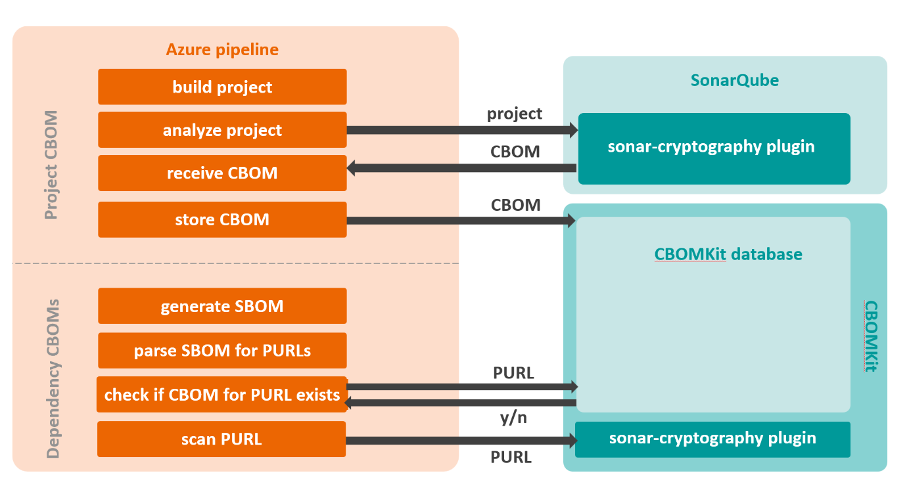

# CBOMKit Pipeline 

The CBOMKit pipeline is designed to generate a **Cryptographic Bill of Materials (CBOM)** for a repository and its dependencies. It works by:

1. Running the **[SonarCryptography plugin](https://github.com/cbomkit/sonar-cryptography)** to identify cryptographic assets in the project repository.
2. Getting a list of the project dependencies by generating a **Software Bill of Materials (SBOM)** using [cdxgen](https://github.com/CycloneDX/cdxgen).
3. Scanning project dependencies with the **SonarCryptography plugin**.
4. Storing all resulting CBOMs in the **[CBOMKit database](https://github.com/cbomkit/cbomkit)**.

This pipeline was tested on **Azure DevOps** (with [this version](https://github.com/cbomkit/cbomkit/commit/76ed3d585af18460f09e4166754a149b3a978791) of CBOMKit) and can be integrated with existing workflows.

---

# Usage Instructions

## 1. Clone an Example Project
- Clone [Mastercard client-encryption-java](https://github.com/Mastercard/client-encryption-java) into your Azure DevOps repository.
- Create a new Azure DevOps pipeline and copy the content of the `pipeline.yml` file into it.

## 2. Set Up SonarQube
- Install [SonarQube](https://docs.sonarsource.com/sonarqube-server/latest/server-installation/introduction/).
- Install the [SonarCryptography plugin](https://docs.sonarsource.com/sonarqube-server/latest/server-installation/plugins/install-a-plugin/).

## 3. Configure a New SonarQube Project
- [Create a project in SonarQube](https://docs.sonarsource.com/sonarqube-server/devops-platform-integration/azure-devops-integration/creating-your-project).
- Note the **project key**, **project name**, and **project token**.
- Update the script and replace `<your-project-key>` and `<your-project-name>` with your values.

## 4. Configure Azure DevOps Service Connection
- [Create a service connection](https://docs.sonarsource.com/sonarqube-server/devops-platform-integration/azure-devops-integration/setting-up-project-integration) using the IP/URL of your SonarQube instance and your project token.
- Note the **service connection name**.
- Update the script and replace `<your-service-connection-name>` with your connection name.

## 5. Apply the SonarCryptography Ruleset
- Add the [SonarCryptography ruleset](https://github.com/PQCA/sonar-cryptography#using) to your SonarQube project.

## 6. Install CBOMKit
- Deploy [CBOMKit](https://github.com/cbomkit/cbomkit#quickstart)
- Update your script and replace `<your-CBOMKit-IP>` with your CBOMKit server IP/URL.

---

## ⚠️ Note: Pipeline Limitations
The pipeline is experimental and has certain known limitations:
- Not all dependencies may be resolved (due to limitations of the 3rd‑party service used by the SonarCryptography plugin).
- Only the languages and libraries from [CBOMKit's list of supported languages and libraries](https://github.com/cbomkit/sonar-cryptography#supported-languages-and-libraries) will result in a CBOM. For Java projects, only the ones built with Maven are currently scannable.
- Scans for large repositories may fail — increase RAM/CPU for the CBOMKit instance if needed.
- The CBOMKit Docker container may run out of disk space — clean leftover artifacts regularly.
- If using a VPN, import the VPN certificates into the Java Trust Store of the CBOMKit Docker container.
